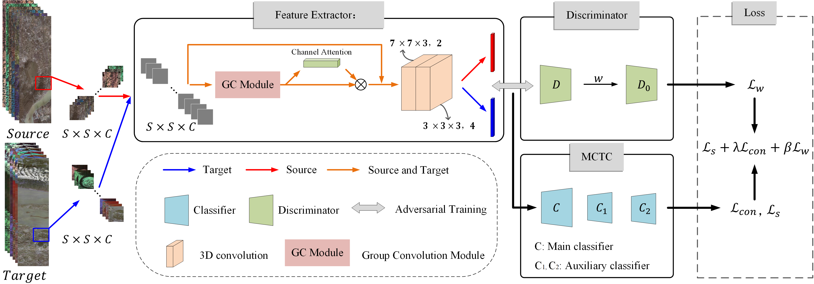
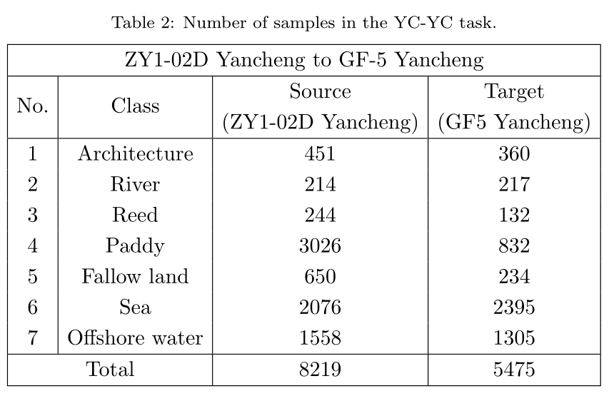
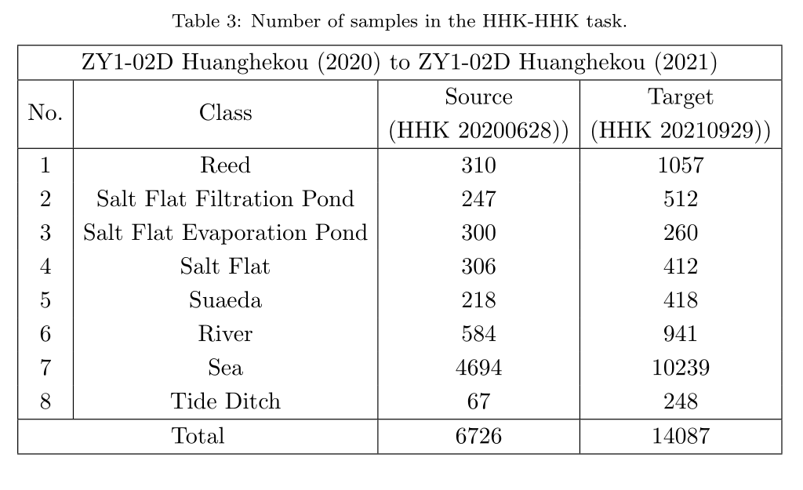
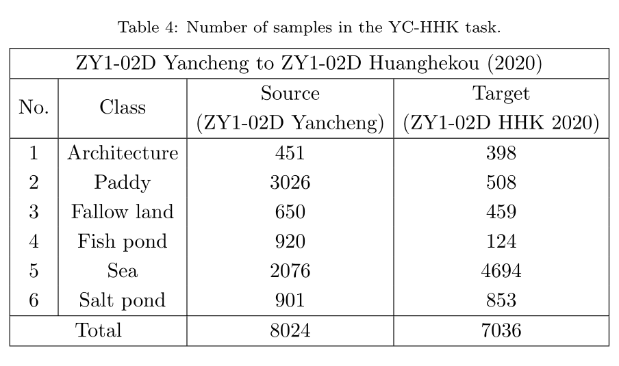

# Cross-Scene Wetland Mapping on Hyperspectral Remote Sensing Images using Adversarial Domain Adaptation Network

<p align='center'>
  
</p>

## Abstract

Wetlands are one of the most important ecosystems on the Earth, and using hyperspectral remote sensing (RS) technology for fine wetland mapping is important for restoring and protecting the natural resources of coastal wetlands. However, the high cost in collecting labeled samples and inconsistent acquisition conditions across different geographic regions or scenes lead to difficulties in wetland mapping and classification.
To mitigate these difficulties, a spatial-spectral weighted adversarial domain adaptation (SSWADA) network is proposed for the cross-scene wetland mapping using hyperspectral image (HSI).
The proposed SSWADA employs an idea of weighted adversarial discrimination to align the feature distribution of source and target scenes,
where a generator or feature extractor with joint 2D-3D convolution is used to extract spatial-spectral features of HSI,
a weighted discriminator is constructed to perform source instance weighting and
a multi-classifier structure is designed to improve the classification performance on target samples.
Experimental results on four different tasks show that our SSWADA outperforms existing domain adaptation methods for cross-scene wetland mapping.


## Descriptions

Two representative study areas in China, i.e., Yancheng and Huanghekou (i.e, Yellow River Estuary) wetlands, are selected.
For Yancheng wetland, there are two HSIs acquired by the
the Advanced Hyperspectral Imager (AHSI) aboard on China's Ziyuan1-02D (ZY1-02D) and GaoFen-5 (GF-5) satellites, respectively.
For Huanghekou wetland, there are also two HSIs acquired by the
AHSI aboard on China's ZY1-02D satellite in June 28, 2020 and September 29, 2021, respectively.



Table 2: ZY1-02D Yancheng to GF-5 Yancheng



Table 3: ZY1-02D Huanghekou (2020) to ZY1-02D Huanghekou (2021)



Table 4: ZY1-02D Yancheng to ZY1-02D Huanghekou (2020)

##Dataset:

The dataset directory should look like this (three tasks):

```bash
datasets
├── ZYYC to GFYC
│   ├── ZY_YC_data147.mat
│   ├── ZY_YC_gt7.mat
│   ├── GF_YC_data.mat
│   └── GF_YC_gt.mat
└── HHK to HHK
│   ├── ZY_HHK_data108_20200628.mat
│   ├── ZY_HHK_gt108_20200628.mat
│   ├── ZY_HHK_data108_20210929.mat
│   └── ZY_HHK_gt108_20210929.mat
└── ZYYC to ZYHHK
    ├── ZY_YC_data119.mat
    ├── ZY_YC_gt6.mat
    ├── ZY_HHK_data119.mat
    └── ZY_HHK_gt6.mat

```

## Usage

You can download [datasets](https://doi.org/10.5281/zenodo.8105220) here.

## Note

- The variable names of data and gt in .mat file are set as `Data` and `DataClass`.

## Paper

Please cite our paper if you find the code or dataset useful for your research.

@article{HUANG202337,
title = {Cross-scene wetland mapping on hyperspectral remote sensing images using adversarial domain adaptation network},
journal = {ISPRS Journal of Photogrammetry and Remote Sensing},
volume = {203},
pages = {37-54},
year = {2023},
issn = {0924-2716},
doi = {https://doi.org/10.1016/j.isprsjprs.2023.07.009},
author = {Yi Huang and Jiangtao Peng and Na Chen and Weiwei Sun and Qian Du and Kai Ren and Ke Huang}
}
